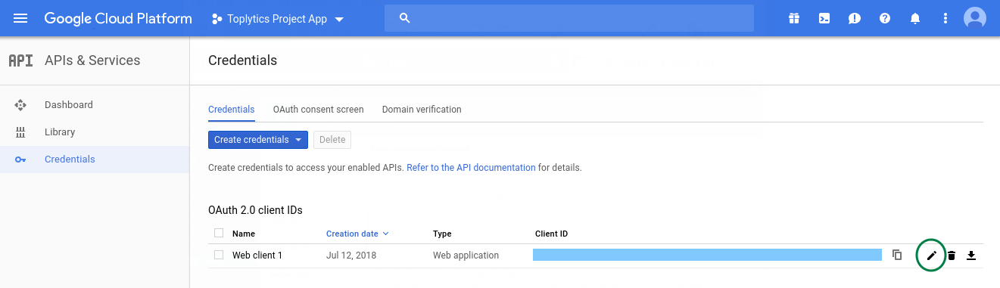
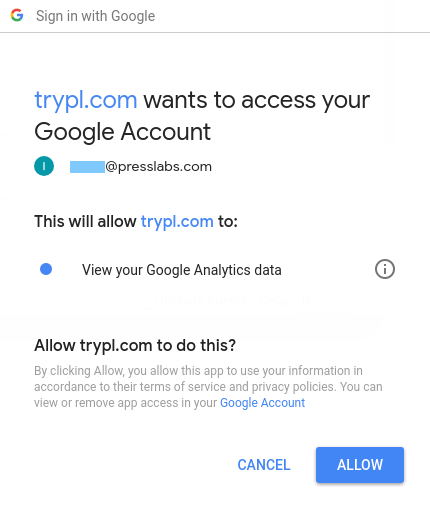
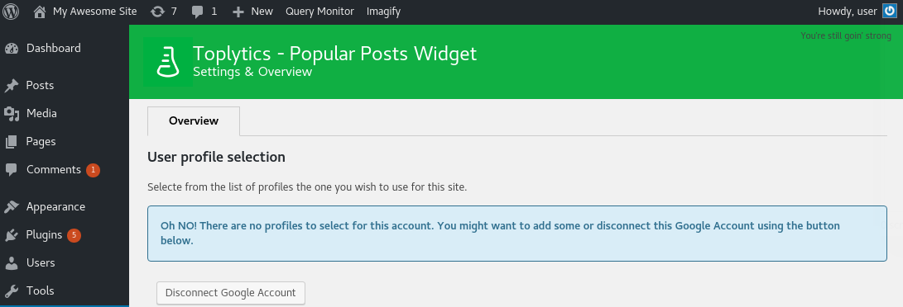
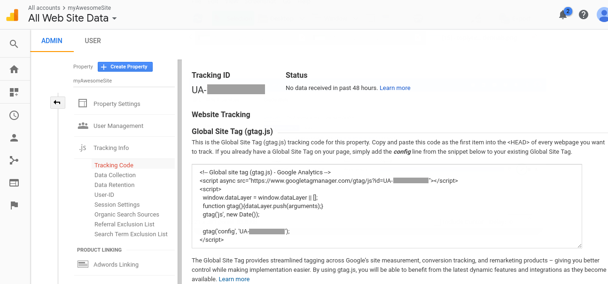

# Install and configure Toplytics
You can simply search it in the WordPress plugins, install and activate it, or [download it](https://www.presslabs.org/toplytics/) and upload it in wp-content/plugins and again activate it from WordPress.

As mentioned before, Toplytics displays the most visited posts as a widget using data extracted from Google Analytics, so it needs to be connected to Google Analytics. We offer two possibilities to use Toplytics: through **Public Authorization** or the **Private Authorization**.

## Public Authorization
To use the **Public Authorization** simply press the **Log in with your Google Account via Presslabs.org** button and you will be redirected to the Google Authorization screen where you will be asked for read access to your analytics profiles. This method is using the Presslabs public API key to authenticate you to the Google Analytics API, so no further configuration is needed. 

## Private Authorization
The private authorization is the recommanded way in using Toplytics, as it offers you complete control over the connection by using your very own API keys and application for granting access. 

You need to enter your Client ID and Client Secret from your Google Analytics account. The next steps will guide you in configuring your Google Analytics account to Toplytics. Keep in mind that you will need the **Redirect URL** mentioned in this page further in configuring Toplytics.

### Step 1: Register client application with Google

Every application has to be registered with the Google API so that we can use the OAuth 2.0 token during the authentication and authorisation process. To register an application the user has to login to the Google account and go to [Google API Dashboard](https://console.developers.google.com/).

#### 1.1. Create new project

From Google API console create a new project using the “Create Project” button. To set up properly the client application, select a unique “project name”.

#### 1.2. Enable the Analytics API
From the Google API Dashboard go to **Enable APIs and Services** and browse the library to find the **Analytics API**, then click it and enable it. 

#### 1.3. Create new Client ID
Go to the **Credentials -> OAuth consent screen** tab to set up your product name.

After you set up your product name, you can create your credentials. Go back to the **Dashboard** section, click on the arrow of the button **Create credentials** and choose the **OAuth Client ID** option. 

When asked to choose your application type choose the **Web application** option. You will be asked to introduce the **Javascript Origins** and **Redirects URI's**. As **Authorized JavaScipt Origins** introduce your domain name, and as **Authorized redirect URI** you need to introduce the [Redirect URL](./installation/#private-authorization) from `Settings -> Toplytics -> Private Authorization`.

Your newly created credentials will appear on the **Credentials** page and the **Client ID** and **Client secret** you need to authorize the **Private Authentification** will appear in a pop up. You can also see them by pressing the **Edit OAuth Client** button from the Credentials section.

### Step 2: Authorising Requests

Copy the Client ID and the Client Secret keys from the **Credentials section**, then go back to `Settings -> Toplytics -> Private Authorization` to paste these credentials. By using these keys the client application will avoid sharing the username and/or password with any other Toplytics users.

Click the **Private Authorize** button and after logging in you need to agree that the newly created app will access your Analytics data and you are all set.

You can select from the list of profiles the one you want to use for this site or you can disconnect your Google account.

In case you have no user profile set up in your Analytics account, a warning message will appear:

This means you need to set up your site in [Google Analytics](https://www.google.com/analytics/). To set up your site in Google Analytics you need to create an account and to add your site (create a new property). Fill in your website details and click the **Get Tracking ID button**. Here you have a tracking code you need to copy and paste as the first item into the **HEAD** of every webpage you want to track or you can use the **Google Tag Manager** to help you help you add tags to your site.

