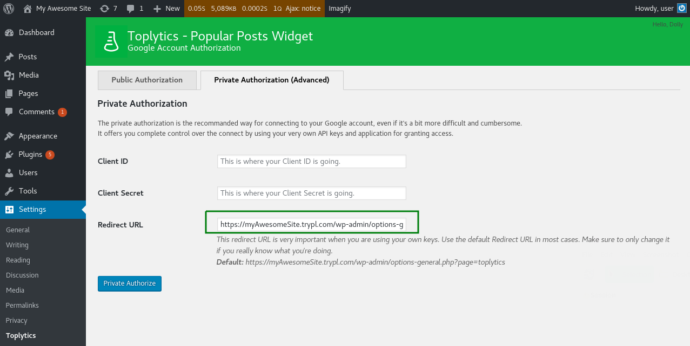

# Install and configure Toplytics
You can simply search it in the WordPress plugins, install and activate it, or [download it](https://www.presslabs.org/toplytics/) and upload it in wp-content/plugins and again activate it from WordPress.

As mentioned before, Toplytics displays the most visited posts as a widget using data extracted from Google Analytics, so it needs to be connected to Google Analytics. We offer two possibilities to use Toplytics: through **Public Authorization** or the **Private Authorization**.

## Public Authorization
To use the **Public Authorization** simply press the **Log in with your Google Account via Presslabs.org** button and you will be redirected to the Google Authorization screen where you will be asked for read access to your analytics profiles. This method is using the Presslabs public API key to authenticate you to the Google Analytics API, so no further configuration is needed. 

## Private Authorization
The private authorization is the recommanded way in using Toplytics, as it offers you complete control over the connection by using your very own API keys and application for granting access. 

You need to enter your Client ID and Client Secret from your Google Analytics account. The next steps will guide you in configuring your Google Analytics account to Toplytics. Keep in mind that you will need the **Redirect URL** mentioned in this page further in configuring Toplytics.

### Step 1: Register client application with Google

Every application has to be registered with the Google API so that we can use the OAuth 2.0 token during the authentication and authorisation process. To register an application the user has to login to the Google account and go to [Google API Dashboard](https://console.developers.google.com/).

#### 1.1. Create new project

From Google API console create a new project using the “Create Project” button. To set up properly the client application, select a unique “project name”.

#### 1.2. Enable the Analytics API
From the Google API Dashboard go to **Enable APIs and Services** and browse the library to find the **Analytics API**, then click it and enable it. 

#### 1.3. Create new Client ID
Go to the **Credentials -> OAuth consent screen** tab to set up your product name.

After you set up your product name, you can create your credentials. Go back to the **Dashboard** section, click on the arrow of the button **Create credentials** and choose the **OAuth Client ID** option. When asked to choose your application type choose the **Other** option and your product name will appear below, then press **Create**.

#### 1.4. Download the JSON file with the API credentials (Auth Config file)
Your newly created credentials will appear on the **Credentials** page, and you need to download the JSON file with the API credentials using the download button.

### Step 2: Authorising Requests

You can get the Client ID and the Client Secret keys by pressing the **Edit OAuth Client** button from the Credeantials section (the one near the download button). By using these keys the client application will avoid sharing the username and/or password with any other Toplytics users.

When the client application is executed, it prompts the users to allow access and redirects the users to the Google URL which will provide an authorisation code. The authorisation code is fed back to the client application which then uses the code to get the access token. In this way a secure connection is established between Toplytics and the newly created application, that will offer the data from Google Analytics, needed by Toplytics to display the most visited posts from your site.

In this step please connect to your Google Analytics Account from the Toplytics settings page in your wp-admin.

#### 2.1. Get Authorization Key

Click the Get Authorization Key button from the plugin's settings page and you will be redirected to google.com;

#### 2.2. Grant Access to Analytics

After logging in you need to agree that the newly created app will access your Analytics data. After that you get a key;

#### 2.3. Connect the plugin to Analytics

Then come back to the plugin settings page and use the key in the Authorization Key field. Click on Get Analytics Profiles button, select the profile for your current site and click on Connect.

