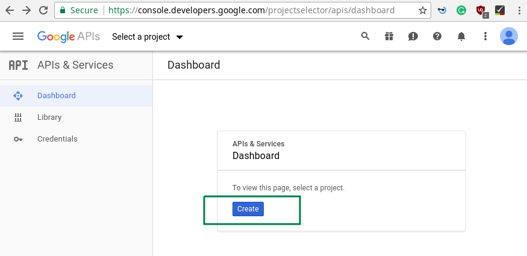
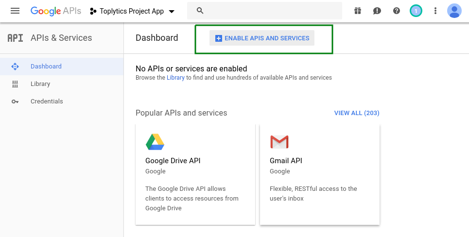
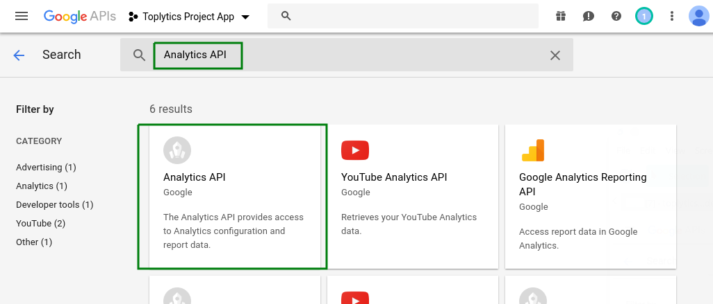
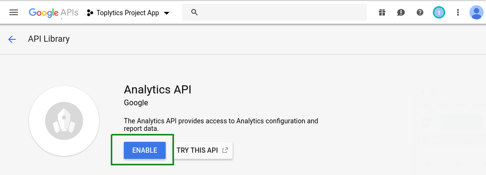
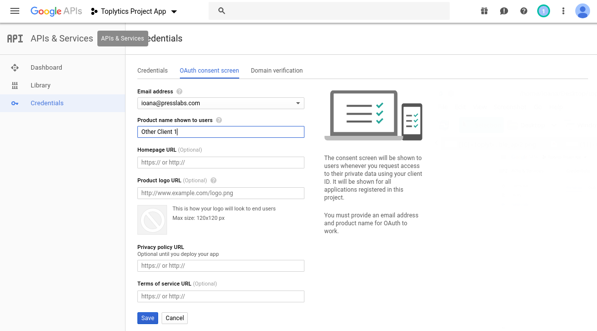
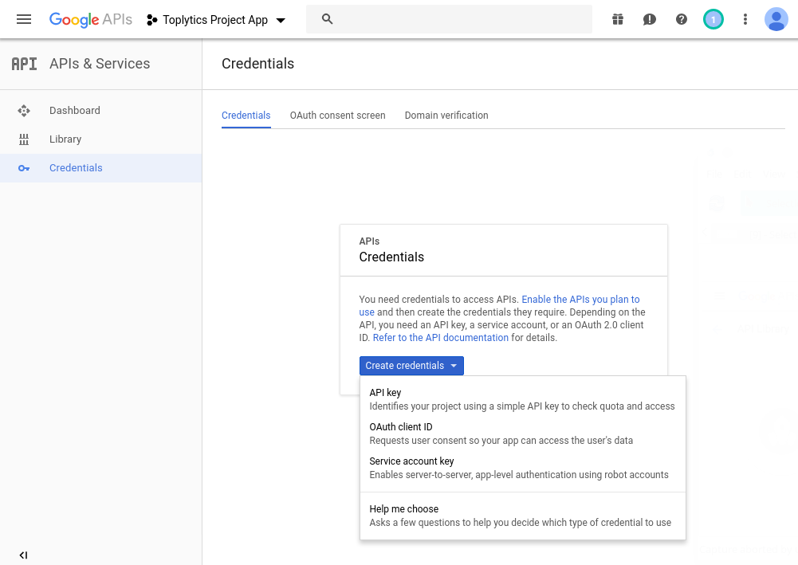
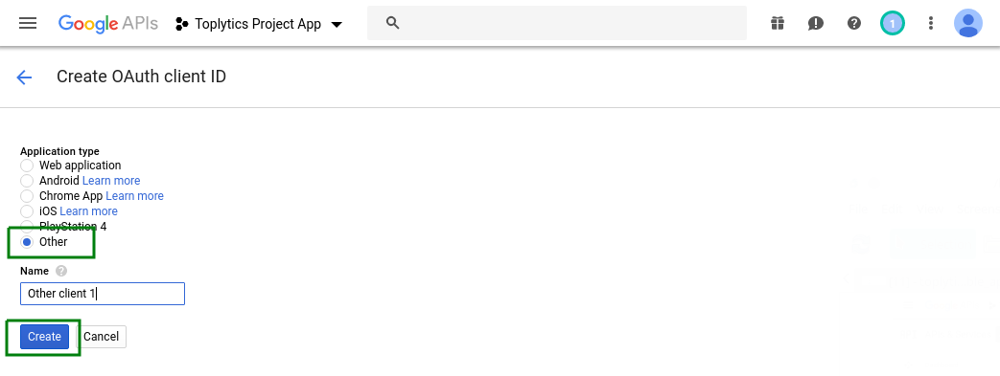
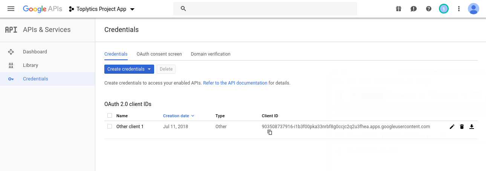

## Toplytics Usage

Connect your plugin with Google Analytics Account from the Settings page (Settings -> Toplytics); Use the Toplytics widget from the Appearance -> Widgets page;

## Installing

### Register client application with Google (configuration step 1)

Every application has to be registered with the Google API so that we can use the OAuth 2.0 token during the authentication and authorisation process. To register an application the user has to login to the Google account and go to [Google API Dashboard](https://console.developers.google.com/).

#### 1. Create new project

From Google API console create a new project using the “Create Project” button. To set up properly the client application, select a unique “project name”.

#### 2. Enable the Analytics API

#### 3. Create new Client ID

#### 4. Download the JSON file with the API credentials (Auth Config file)

### Authorising Requests (configuration step 2)

At the end of the registration process you will be able to get the clientId and the clientSecret keys. By using these keys the client application will avoid sharing the username and/or password with any other Toplytics users.

When the client application is executed, it prompts the users to allow access and redirects the users to the Google URL which will provide an authorisation code. The authorisation code is fed back to the client application which then uses the code to get the access token. In this way a secure connection is established between Toplytics and the newly created application, that will offer the data from Google Analytics, needed by Toplytics to display the most visited posts from your site.

In this step please connect to your Google Analytics Account from WordPress Toplytics settings page.

#### 1. Get Authorization Key

Click the Get Authorization Key button from the plugin's settings page and you will be redirected to google.com;

#### 2. Grant Access to Analytics

After logging in you need to agree that the newly created app will access your Analytics data. After that you get a key;

#### 3. Connect the plugin to Analytics

Then come back to the plugin settings page and use the key in the Authorization Key field. Click on Get Analytics Profiles button, select the profile for your current site and click on Connect.

