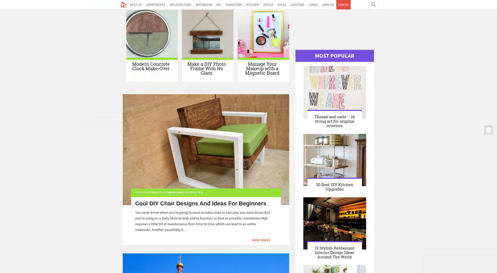

# Toplytics Usage

Toplytics displays the most visited posts as a widget from the `Appearance -> Widgets` page. Simply drag-and-drop your newly available Toplytics widget wherever you want to display it. 

You can set up a title, the number of posts to show, the statistics period and if you want to display post views. You can now visualize your most visited posts. Here is an example of using Toplytics on www.homedit.com:

You also have the possibility to change the default template. Here it is how.
